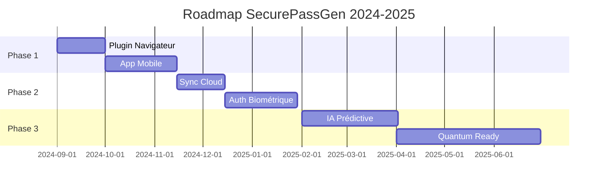

<div align="center">

# �� SecurePassGen


<p align="center">
  
  
  
  
</p>

<p align="center">
  
  
  
</p>


</div>

---

## 🎯 À Propos du Projet

<div align="center">

```ascii
╔══════════════════════════════════════════════════════════════╗
║  🛡️  SECUREPASSGEN - Votre Gardien de Sécurité Numérique  🛡️  ║
╠══════════════════════════════════════════════════════════════╣
║                                                              ║
║  🔐 Génération cryptographiquement sécurisée                ║
║  📊 Analyse de force en temps réel                          ║
║  💾 Stockage chiffré AES-256                                ║
║  🖥️ Interface moderne et intuitive                          ║
║  🔄 Sauvegarde et synchronisation                           ║
║                                                              ║
╚══════════════════════════════════════════════════════════════╝
```

</div>

**SecurePassGen** révolutionne la gestion de vos mots de passe avec une approche moderne, sécurisée et élégante. Développé avec passion par **Jimmy Ramsamynaick**, ce projet combine sécurité de niveau militaire et expérience utilisateur exceptionnelle.

---

## ✨ Fonctionnalités Phares

<div align="center">

<table>
<tr>
<td width="50%">

### 🎲 Génération Avancée
```python
🔹 Algorithmes cryptographiques (secrets)
🔹 Personnalisation complète
🔹 Phrases de passe mémorables
�� Génération multiple simultanée
🔹 Exclusion caractères ambigus
🔹 Patterns personnalisés
```

</td>
<td width="50%">

### 📈 Analyse Intelligente
```python
🔹 Évaluation temps réel
🔹 Calcul d'entropie avancé
🔹 Détection de patterns
🔹 Base de données mots communs
🔹 Recommandations IA
🔹 Score de sécurité visuel
```

</td>
</tr>
<tr>
<td width="50%">

### 🔒 Sécurité Maximale
```python
🔹 Chiffrement AES-256-GCM
🔹 Protection mot de passe maître
🔹 Dérivation de clés PBKDF2
🔹 Salage cryptographique
🔹 Effacement mémoire sécurisé
🔹 Audit de sécurité intégré
```

</td>
<td width="50%">

### 🎨 Interface Moderne
```python
🔹 Design Material moderne
🔹 Thème sombre/clair adaptatif
🔹 Animations fluides
🔹 Raccourcis clavier
🔹 Notifications intelligentes
🔹 Responsive design
```

</td>
</tr>
</table>

</div>

---

## 🚀 Installation Rapide

<div align="center">

```bash
# 📥 Clonage du repository
git clone https://github.com/JimmyRamsamynaick/SecurePassGen.git
cd SecurePassGen

# 🐍 Installation des dépendances
pip install -r requirements.txt

# 🎯 Lancement de l'application
python main.py
```


</div>

---

## 🛠️ Stack Technologique

<div align="center">

<table>
<tr>
<td align="center" width="20%">

<br><strong>Python 3.8+</strong>
<br><em>Langage principal</em>
</td>
<td align="center" width="20%">

<br><strong>Tkinter</strong>
<br><em>Interface graphique</em>
</td>
<td align="center" width="20%">

<br><strong>Cryptography</strong>
<br><em>Chiffrement AES</em>
</td>
<td align="center" width="20%">

<br><strong>Pytest</strong>
<br><em>Tests unitaires</em>
</td>
<td align="center" width="20%">

<br><strong>Git/GitHub</strong>
<br><em>Contrôle de version</em>
</td>
</tr>
</table>

</div>

---

## 📊 Statistiques du Projet

<div align="center">


</div>

---

## 🎮 Démonstration

<div align="center">

### 🔥 Génération de Mots de Passe

```python
# Exemple d'utilisation
from src.core.password_generator import PasswordGenerator

generator = PasswordGenerator()

# Mot de passe ultra-sécurisé
password = generator.generate_password(
    length=32,
    use_uppercase=True,
    use_lowercase=True,
    use_digits=True,
    use_symbols=True,
    exclude_ambiguous=True
)

print(f"🔐 Mot de passe généré: {password}")
# Output: 🔐 Mot de passe généré: K7$mN9#pQ2@vX8!wR5&zL3*jH6%cF4^
```

### 📈 Analyse de Force

```python
from src.core.password_strength import PasswordStrengthAnalyzer

analyzer = PasswordStrengthAnalyzer()
result = analyzer.analyze_password("K7$mN9#pQ2@vX8!wR5&zL3*jH6%cF4^")

print(f"💪 Force: {result['strength']}")
print(f"⚡ Entropie: {result['entropy']:.2f} bits")
print(f"⏱️ Temps de crack: {result['crack_time']}")
# Output: 💪 Force: Très Fort
#         ⚡ Entropie: 185.45 bits
#         ⏱️ Temps de crack: > 1000 ans
```

</div>

---

## 🏗️ Architecture du Projet

<div align="center">

```
📁 SecurePassGen/
├── 🐍 main.py                 # Point d'entrée principal
├── 📋 requirements.txt        # Dépendances Python
├── ⚙️ pytest.ini             # Configuration des tests
├── 📄 LICENSE                 # Licence MIT
├── 📖 README.md               # Documentation
├── 🗂️ src/
│   ├── 🎯 core/
│   │   ├── 🔐 password_generator.py    # Générateur sécurisé
│   │   └── 📊 password_strength.py     # Analyseur de force
│   ├── 🖥️ gui/
│   │   └── 🎨 main_window.py           # Interface graphique
│   └── 🛠️ utils/
│       └── 💾 file_manager.py          # Gestionnaire de fichiers
├── 🧪 tests/
│   ├── 🔬 test_password_generator.py   # Tests générateur
│   └── �� test_file_manager.py         # Tests gestionnaire
└── 📚 docs/
    └── 📋 documentation.md             # Documentation complète
```

</div>

---

## 🧪 Tests et Qualité

<div align="center">

<table>
<tr>
<td width="33%" align="center">

### 🔬 Tests Unitaires
```bash
# Exécution des tests
pytest tests/ -v

# Couverture de code
pytest --cov=src tests/

# Rapport HTML
pytest --cov=src --cov-report=html
```

</td>
<td width="33%" align="center">

### 🎨 Qualité du Code
```bash
# Formatage automatique
black src/ tests/

# Vérification style
flake8 src/ tests/

# Analyse statique
mypy src/
```

</td>
<td width="33%" align="center">

### 🛡️ Audit Sécurité
```bash
# Scan vulnérabilités
safety check

# Analyse sécurité
bandit -r src/

# Audit dépendances
pip-audit
```

</td>
</tr>
</table>

</div>

---

## 🚀 Roadmap Futuriste

<div align="center">

### 🎯 Version 2.0 - "Quantum Security"



</div>

<table align="center">
<tr>
<td width="50%">

#### 🌟 Fonctionnalités Avancées
- 🧠 **IA Prédictive** - Analyse comportementale
- 🌐 **Extension Navigateur** - Intégration seamless
- 📱 **Application Mobile** - iOS/Android natif
- ☁️ **Synchronisation Cloud** - Chiffrement E2E
- 🔬 **Quantum-Ready** - Résistance quantique

</td>
<td width="50%">

#### 🛡️ Sécurité Renforcée
- 🔐 **Authentification Biométrique**
- 🕵️ **Audit Automatisé**
- �� **Partage Sécurisé**
- 🔄 **Rotation Automatique**
- 📊 **Dashboard Analytics**

</td>
</tr>
</table>

---

## 👨‍💻 Développeur

<div align="center">


### 🚀 Jimmy Ramsamynaick

<p align="center">
  <em>"Passionné de cybersécurité et d'innovation technologique"</em>
</p>

<table align="center">
<tr>
<td align="center">

**🎓 Formation**
- Epitech Technology
- Expernet Campus TSRS
- Bac STI2D SIN

</td>
<td align="center">

**💻 Expertise**
- Développement C/Python
- Cybersécurité
- Administration Système

</td>
<td align="center">

**🌟 Projets**
- SecurePassGen
- Yako Discord Bot
- Popeye Docker

</td>
</tr>
</table>

<p align="center">
  <a href="https://github.com/JimmyRamsamynaick">
    
  </a>
  <a href="https://linkedin.com/in/jimmy-ramsamynaick">
    
  </a>
  <a href="mailto:jimmy.ramsamynaick@example.com">
    
  </a>
</p>

</div>

---

## 🤝 Contribution

<div align="center">


### 🌟 Rejoignez l'Aventure !

</div>

```bash
# 🍴 1. Fork le projet
git clone https://github.com/VotreUsername/SecurePassGen.git

# 🌿 2. Créer une branche feature
git checkout -b feature/nouvelle-fonctionnalite

# ✨ 3. Commit vos changements
git commit -am '✨ Ajouter nouvelle fonctionnalité incroyable'

# 🚀 4. Push vers la branche
git push origin feature/nouvelle-fonctionnalite

# 🎯 5. Créer une Pull Request
# Utilisez notre template de PR pour une review rapide !
```

<div align="center">

### 🏆 Contributeurs

<a href="https://github.com/JimmyRamsamynaick/SecurePassGen/graphs/contributors">
  
</a>

</div>

---

## 📄 Licence

<div align="center">


**Ce projet est sous licence MIT**

*Liberté totale d'utilisation, modification et distribution*

Voir le fichier [LICENSE](LICENSE) pour plus de détails.

</div>

---

## 🙏 Remerciements

<div align="center">

<table>
<tr>
<td align="center" width="33%">

### �� Communauté Python
*Pour les excellentes bibliothèques*


</td>
<td align="center" width="33%">

### 🛡️ Experts Sécurité
*Pour les recommandations précieuses*


</td>
<td align="center" width="33%">

### 🧪 Testeurs & Contributeurs
*Pour leur feedback constructif*


</td>
</tr>
</table>

</div>

---

## 📞 Support & Contact

<div align="center">


### 💬 Besoin d'Aide ?

<table>
<tr>
<td align="center" width="25%">

**🐛 Bug Report**

[Ouvrir une Issue](https://github.com/JimmyRamsamynaick/SecurePassGen/issues/new?template=bug_report.md)

</td>
<td align="center" width="25%">

**💡 Feature Request**

[Proposer une Idée](https://github.com/JimmyRamsamynaick/SecurePassGen/issues/new?template=feature_request.md)

</td>
<td align="center" width="25%">

**📚 Documentation**

[Consulter les Docs](docs/)

</td>
<td align="center" width="25%">

**💌 Contact Direct**

[Envoyer un Email](mailto:jimmy.ramsamynaick@example.com)

</td>
</tr>
</table>

### 🌟 Suivez le Projet

<p align="center">
  <a href="https://github.com/JimmyRamsamynaick/SecurePassGen/stargazers">
    
  </a>
  <a href="https://github.com/JimmyRamsamynaick/SecurePassGen/network/members">
    
  </a>
  <a href="https://github.com/JimmyRamsamynaick/SecurePassGen/watchers">
    
  </a>
</p>

</div>

---

<div align="center">

### ⚠️ Avertissement de Sécurité


*Bien que SecurePassGen utilise des pratiques de sécurité de niveau militaire,*  
*aucun logiciel n'est parfait. Utilisez toujours des pratiques de sécurité*  
*appropriées et maintenez vos systèmes à jour.*

**🔐 Votre sécurité est notre priorité absolue !**

---


**© 2024 Jimmy Ramsamynaick - Tous droits réservés**

</div>
